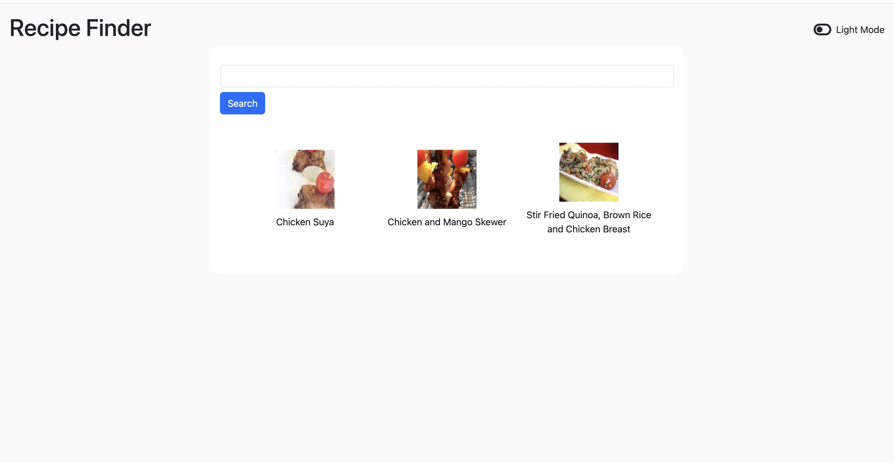

# Recipe Finder App

A React and TypeScript based recipe app that allows users to search for recipes and view their details. This app leverages the Spoonacular API to fetch recipe data.

## Features

- **Search Recipes**: Enter ingredients or dish names in the input field to search for recipes.
- **Recipe Display**: Displays a list of recipes based on the search query, including the recipe name, image, and a link to the full recipe details.
- **Responsive Design**: The app is fully responsive and works well on mobile and desktop devices.
- **Toggle dark mode**: A switch to toggle between light and dark mode for more user interactivity.

## Technologies Used

- **React** - A JavaScript library for building user interfaces.
- **TypeScript** - A superset of JavaScript that adds static typing to the language.
- **Spoonacular API** - Used to fetch recipe data. [Spoonacular API Documentation](https://spoonacular.com/food-api)
- **CSS** - Basic styling for the layout.

## How It Works

1. **User Input**: The user types a search query (such as ingredients or recipe name) into the search input field.
2. **API Request**: When the user clicks the search button, the app sends a request to the Spoonacular API with the search term.
3. **Display Results**: The app then displays a list of recipes matching the search term, showing basic details like the recipe name, image, and a link to the recipe's page.

## Spoonacular API Usage

This app uses the [Spoonacular API](https://spoonacular.com/food-api) to fetch recipe data. Please note that the API has a daily limit of **150 requests** for free-tier accounts. If you exceed this limit, you will have to wait until the next day for additional requests.

## Setup Instructions

To run the project locally, follow the steps below:

1. **Clone the repository**:
   ```bash
   git clone https://github.com/decencyokobia/mini-recipe-app.git
   ```
   
2. **Navigate into the project directory**:
   ```bash
   cd recipe-finder-app
   ```

3. **Install dependencies**:
   ```bash
   npm install
   ```

4. **Create a `.env` file** in the root of the project and add your Spoonacular API key:
   ```
   REACT_APP_SPOONACULAR_API_KEY=your_spoonacular_api_key
   ```

5. **Start the development server**:
   ```bash
   npm start
   ```

   Open your browser and go to `http://localhost:3000` to see the app in action.

## Screenshots

  


## Contributing

Contributions are welcome! Feel free to fork the repository and submit pull requests.

## License

This project is licensed under the MIT License - see the [LICENSE](LICENSE) file for details.
